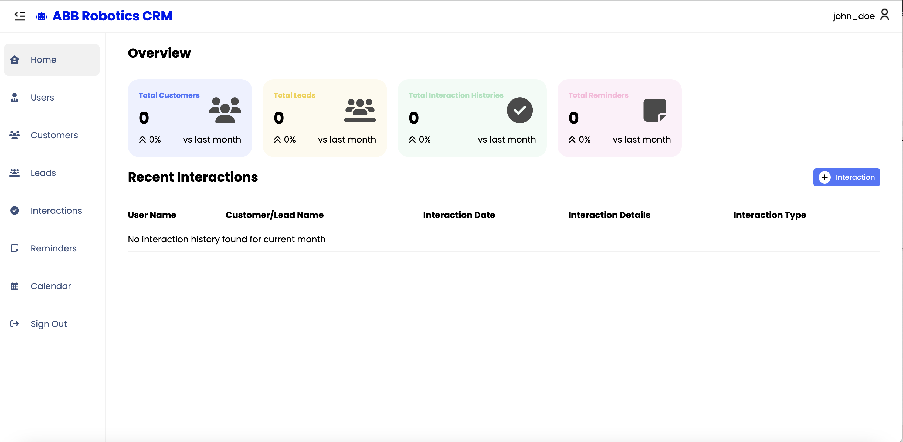
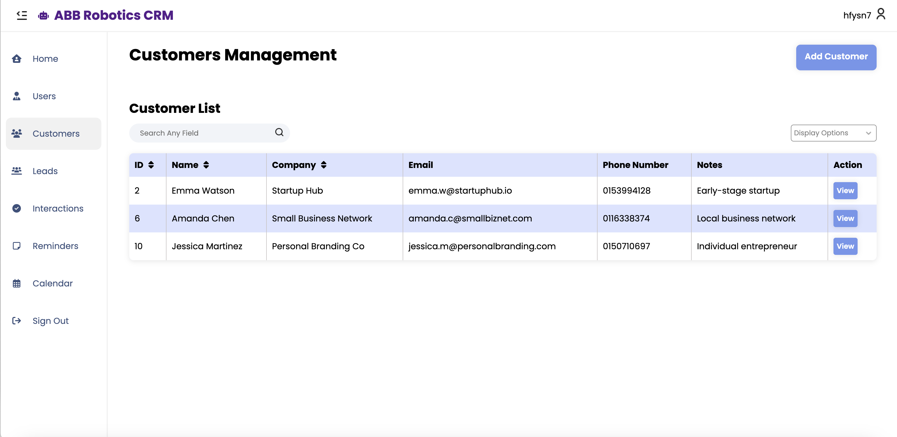
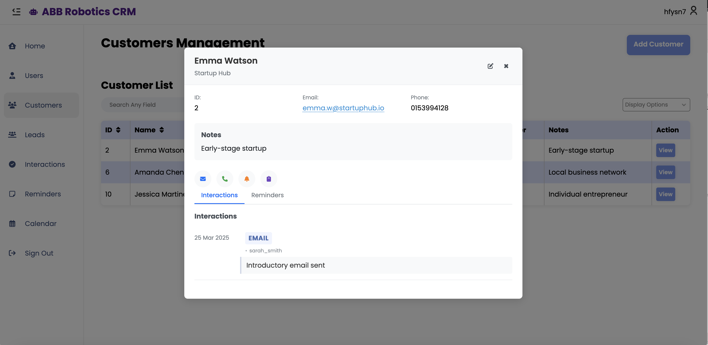
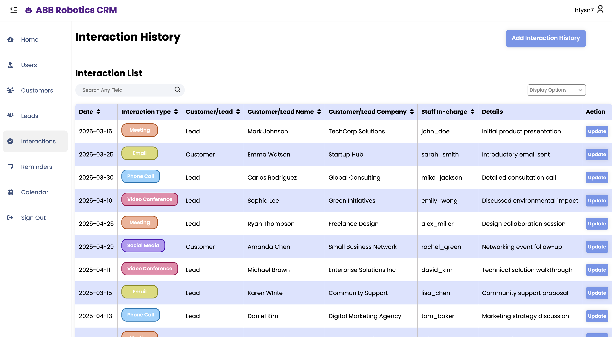
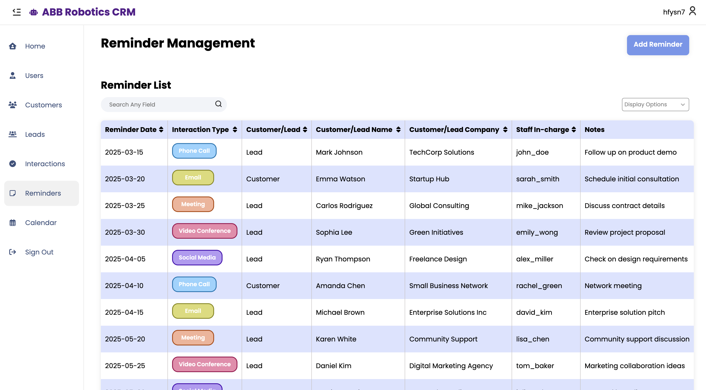
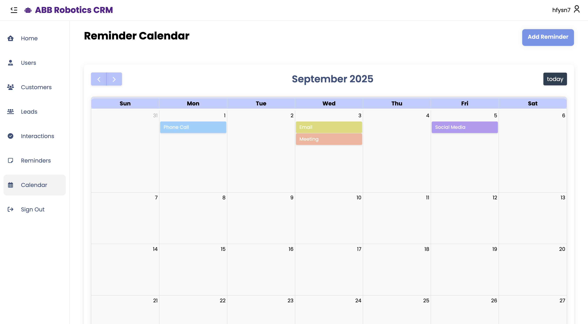

# Customer Relationship Management (CRM) System

A lightweight **Customer Relationship Management (CRM)** web application built using **PHP**, **MySQL**, **JavaScript**, and **CSS**.  
This project was developed as part of coursework to practice **web development** and **database integration**.

---

## 🚀 Features
- 🔑 User authentication (sign up, login, secure sessions)
- 👥 Customer management (add, edit, delete customer records)
- 📈 Lead management (track potential clients)
- 📅 Follow-up reminders
- 📝 Interaction history (track conversations and meetings)
- 🔒 Session security with cookie handling & regeneration

---

## 🛠️ Tech Stack
- **Frontend:** HTML, CSS, JavaScript  
- **Backend:** PHP  
- **Database:** MySQL  

---

## ⚙️ Setup Instructions
1. Clone the repository:
   ```bash
   git clone https://github.com/Shirleyngshuetling/CRM.git
   ````

2. Import the database:

   * Open **phpMyAdmin**
   * Create a new database (e.g., `crm`)
   * Import the provided `db.sql` file
     
3. Configure database connection:

   * Edit `php/config.php` with your database credentials:

     ```php
     $host = "localhost";
     $user = "root";
     $pass = "";
     $dbname = "crm";
     ```
4. Start a local PHP server (if using XAMPP/MAMP):

   ```bash
   php -S localhost:8000
   ```
5. Open in browser:

   ```
   http://localhost:8000/index.php
   ```

---

## 📸 Preview







---

## 🌐 Live Demo

👉 [Click here to try it out](http://shirley.42web.io)

---

## 📂 Repository Structure

```
crm-system/
│── index.php          # Landing page
│── php/               # Backend PHP scripts
│── css/               # Stylesheets
│── js/                # JavaScript files
│── db.sql             # Database schema
│── README.md          # Documentation
```

---

## 📖 Learning Outcomes

* Practiced **full-stack web development**
* Strengthened knowledge in **PHP session management & security**
* Gained experience with **MySQL database design**

